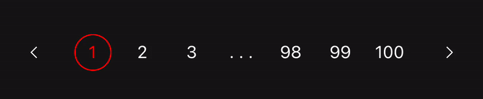

# React-Native-Paging


This component is highly customizeble. Change the styles of every component, change the labels and set your own colors.

## Usage

You can create the component based on either the **number of pages** or the **number of items**

#### Set by number of pages


<br />
```TypeScript
const [currentPage, setCurrentPage] = React.useState<number>(0);
// ...
    <PagingComponent
        current={currentPage}
        onPageSelected={setCurrentPage}
        total={100} // Number of pages
    />
// ...
```
<br />
#### Set by number of items


<br />
```TypeScript
const [currentPage, setCurrentPage] = React.useState<number>(0);
// ...
    <PagingComponent
        current={currentPage}
        onPageSelected={setCurrentPage}
        total={100} // Number of total items
        limit={20} // Number of items per page
    />
// ...
```
<br />
#### Skip to page for item


<br />
```TypeScript
const [currentPage, setCurrentPage] = React.useState<number>(0);
// ...
    <PagingComponent
        current={currentPage}
        onPageSelected={setCurrentPage}
        total={100} // Number of total items
        limit={20} // Number of items per page
    />
// ...
```
## Props
