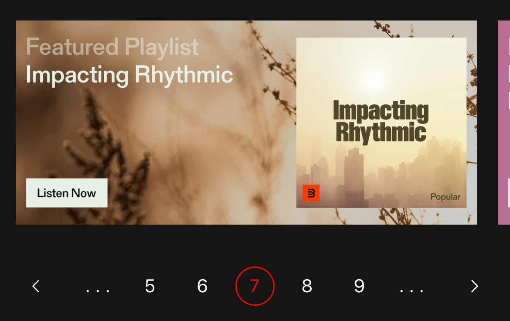

# React-Native-Paging



This component is highly customizeble. Change the styles of every component, change the labels and set your own colors.

## Usage

You can create the component based on either the **number of pages** or the **number of items**

#### Set by number of pages


<br />
```TypeScript
const [currentPage, setCurrentPage] = React.useState<number>(0);
<PagingComponent
    current={currentPage}
    onPageSelected={setCurrentPage}
    total={100} // Number of pages
/>
```
<br />
#### Set by number of items


<br />
```TypeScript
const [currentPage, setCurrentPage] = React.useState<number>(0);
<PagingComponent
    current={currentPage}
    onPageSelected={setCurrentPage}
    total={100} // Number of total items
    limit={20} // Number of items per page
/>
```
<br />

## Props

| Name                     | Type       | Description                                                                                                                                                            |
| ------------------------ | ---------- | ---------------------------------------------------------------------------------------------------------------------------------------------------------------------- |
| `current`              | `Number`   | **Required.** The current page being viewed.                                                                                                                             |
| `onPageSelected`     | `Function`   | **Required.** Callback function when navigating to a new page. `(page: number) => void`                                                                                                                                         |
| `total`   | `Number`   | **Required.** The number of pages or items to display.                                                                                                                           |
| `limit`          | `Number`     | Number of items per page.                                                                                                                                       |
| `onNextPressed`              | `Function`     | Function for the `next` button. `() => void`                                                                                                                                           |
| `onPrevPressed`             | `Function`     | Function for the `previous` button. `() => void`                                                                                                                                                   |
| `containerStyle`         | `Dictionary`   | Change the style for the outer container of the component.                                                                                                                     |
| `itemStyle`     | `Dictionary`   | Change the style for all page indicators.                                                                                                                      |
| `labelStyle`           | `Dictionary` | Change the style for the all the page labels.                                                                             |
| `activeColor` | `String` | Color for currently selected item |
| `mainColor`           | `String` | Primary color used in component.                                                                      |
